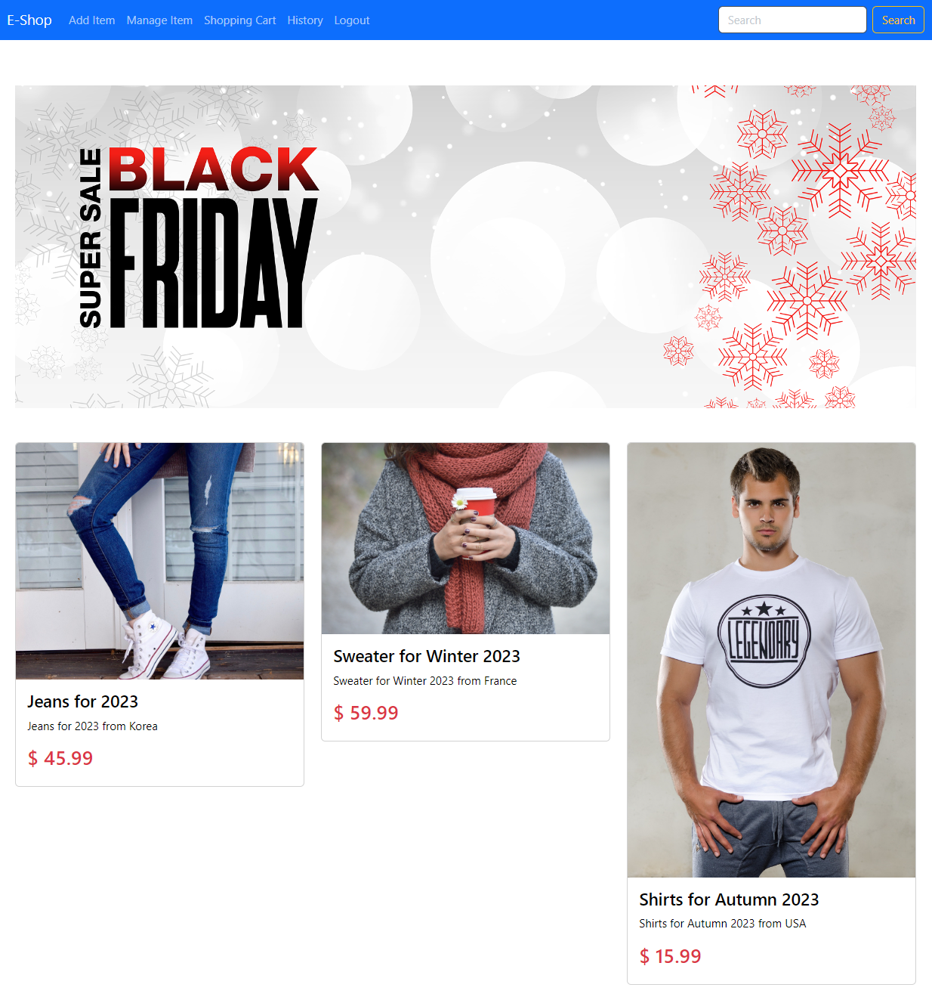
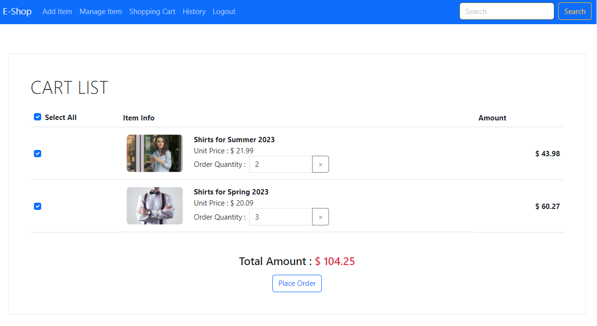
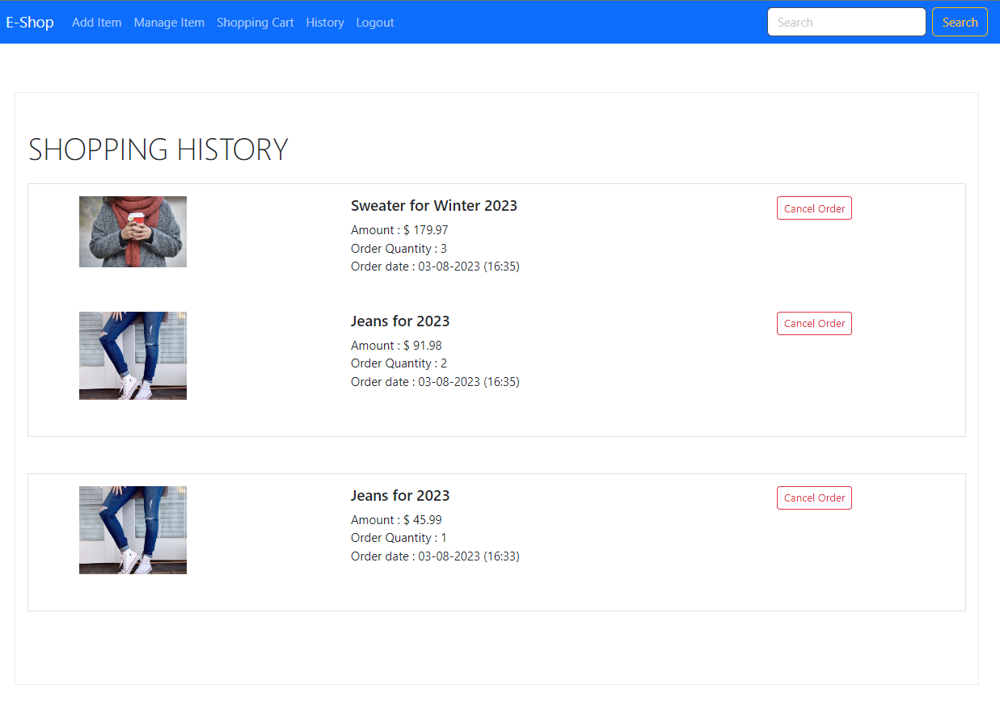
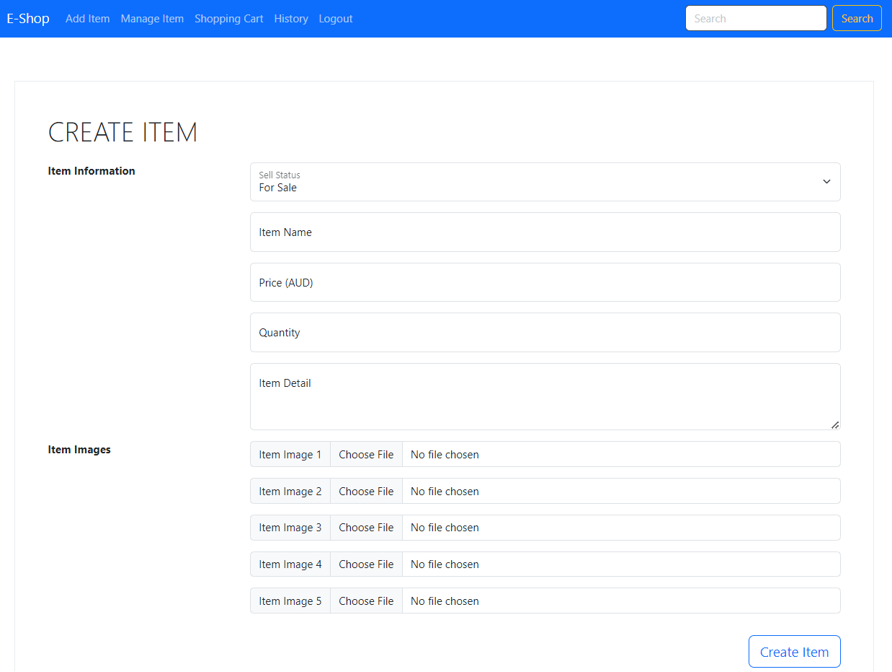
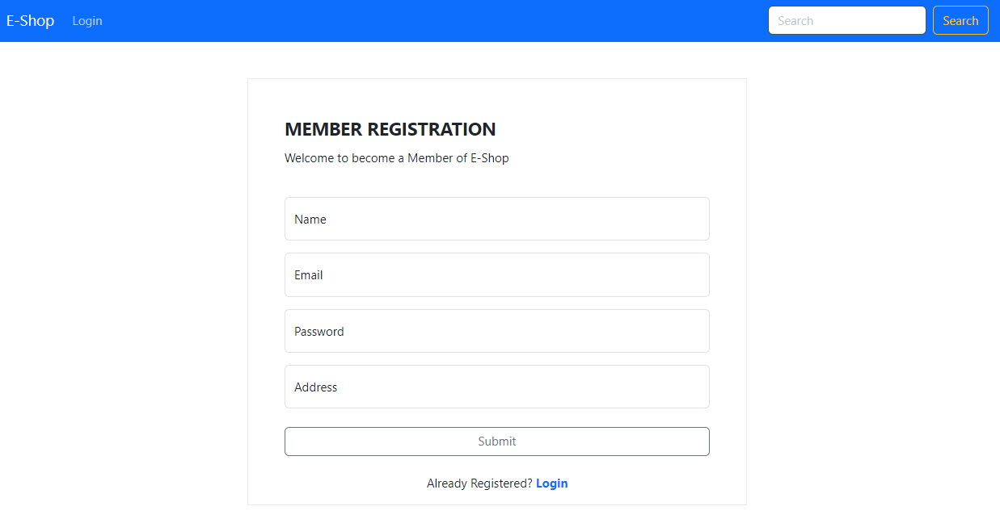

# E Shop with Spring boot
## Intro
Online shopping mall project demo with the following features
+ Common
    - Login/Logout/Sign-up
+ User side
    - To view items in main page
    - To view details by clicking items in the main page
    - To add items into shopping cart
    - To order items from item detail pages or in the shopping cart page
    - To view shopping history
+ Admin side
    - To view item list and add/modify items
## Development Environment
+ Spring boot V 2.7.9
+ Java V 1.8
+ MySQL V 8.0
## Applied Tech
+ Thymeleaf (template)
+ Spring Security
+ Spring JPA
+ thymeleaf-layout-dialect for layout
+ QueryDSL for query builder
+ Modelmapper
## Brief UI
+ main page
  
+ item detail
  
+ cart list
  
+ order history
  
+ add/modify item
  
+ item list
  
+ sign-up
  
+ login
  